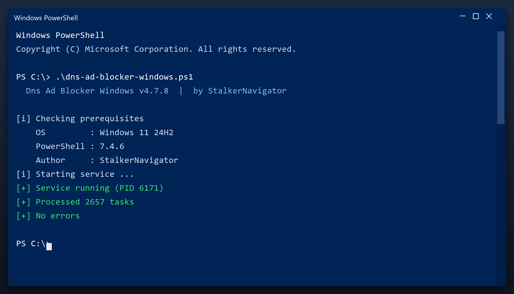

# Dns Ad Blocker Windows — Free 2026 Download

 

Dns ad blocker windows is a lightweight Windows program for maintaining your system. It runs offline, uses very little memory and does not slow your computer down. **Completely free.**

| | |
| --- | --- |
| **Program** | Dns Ad Blocker Windows |
| **Version** | Latest 2026 build |
| **Price** | Free |
| **Systems** | see requirements below |
| **Download** | Quick Start section below |

  

## Before You Start

- Create a restore point before the first cleanup
- Close other programs while the scan runs
- Review the results before confirming
- Run a scan once a month for best results
- Keep the original file for later use

## Requirements

| **Component** | **Requirement** |
| --- | --- |
| **Operating system** | Windows 10 or newer |
| **Processor** | Any x64 CPU |
| **Memory** | 2 GB or more |
| **Storage** | 100 MB free |
| **Display** | 1024x768 or higher |

## Install

1. **Download** the tool from this page
2. **Close** your other programs
3. **Launch** it and let it load
4. **Scan** your system
5. **Clean** the results, then reboot

  

> **Note:** run the tool as administrator so it can clean system folders. Without admin rights it will only touch your own user files.

## What It Does

Dns ad blocker windows is a maintenance tool for Windows. It scans your system for problems such as leftover files and invalid registry entries, then removes or repairs them. Everything happens locally on your PC - nothing is uploaded anywhere.

| **Term** | **Meaning** |
| --- | --- |
| **Registry** | The Windows database of settings |
| **Junk files** | Temporary files left behind by programs |
| **Startup items** | Programs that launch with Windows |
| **Optimize** | Make the system run faster |

## Features

| **Feature** | **Details** |
| --- | --- |
| **Startup manager** | Turn off unneeded startup apps |
| **Disk tools** | Clean, analyse, defragment |
| **Registry** | Scan and repair entries |
| **Privacy** | Clear usage traces |
| **Scheduler** | Automatic weekly scans |
| **Log** | Keeps a record of changes |

## Problems and Fixes

| **Issue** | **Fix** |
| --- | --- |
| **Windows warns about the file** | Click More info, then Run anyway |
| **Slow first launch** | Normal - it indexes on first run |
| **Scan finds nothing** | Good - your PC is already clean |
| **Settings do not save** | Run as admin once so it can write config |

## FAQ

**What exactly does it clean?**

Temporary files, caches, logs, broken shortcuts and unused leftovers. You see a list before anything is removed.

**How long does a scan take?**

One to three minutes for a quick scan; a deep scan takes longer.

**Is it safe for a work PC?**

Yes. It makes a restore point first and never touches your documents.

**Does it send data anywhere?**

No. There is no telemetry and no cloud upload - it is fully local.

---

*astral-crystal-224 · Updated 2026-10-10 · Shared under the MIT License*
